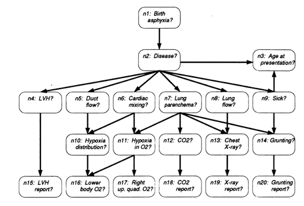
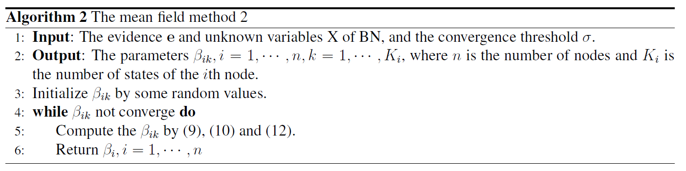
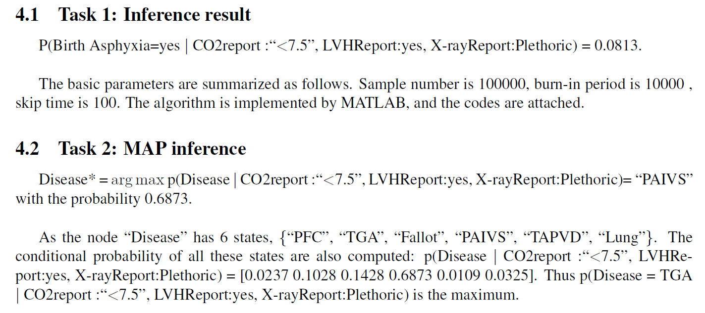

# Bayesian_Approximate_Inference
This project apply the Gibbs sampling and mean field methods to compute the inference and MAP inference. In addition, the exact results are 
computed by the variable elimination method through Jupyter Notebook.
==============================================================================
Code and report of ["Bayesian_Approximate_Inference"] 

## Prerequisites
The proposed method is implemented through Jupyter Notebook. The required packages include:
- Matlab
- Python 3
- Jupyter Notebook

## Getting started
1) modify the path  by the lcoation of the files in the folder of 'dataset';
2) Run the function of 'Gibbs_sampling' 'mean_field' of the matlab codes;
3) The 'Variable Elimination' method is in the Jupyter file of 'Proj1'
 
 

## Bayesian Network

 

## Gibbs ALgorithm

## Mean Field algorithm

## Performance  

